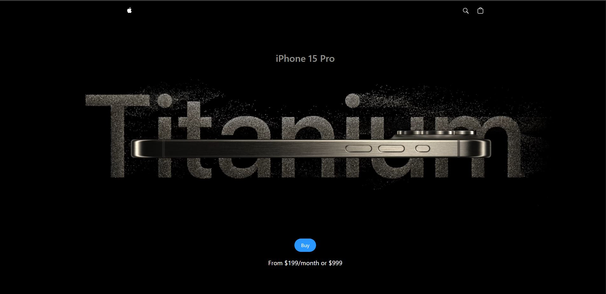
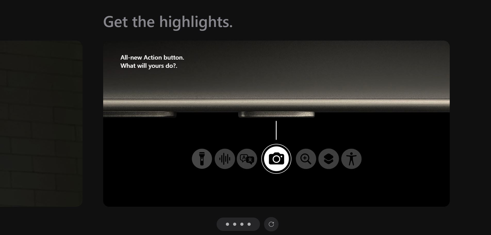
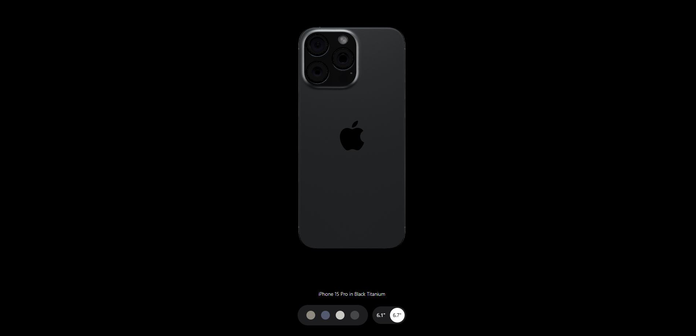
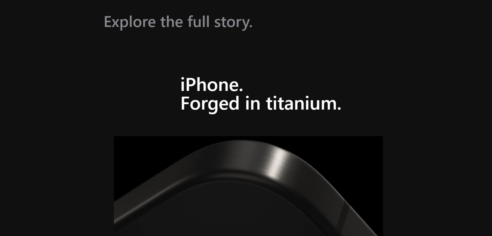
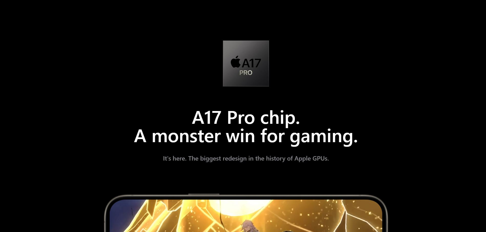

# 🛠 Titanium Frame

Live site: [https://titanium-frame.netlify.app/](https://titanium-frame.netlify.app/)

A smooth and clean Apple-style landing page clone built with modern technologies — React, TypeScript, Vite, Three.js, and TailwindCSS.

---

## 📸 Previews







---

## 🧩 Tech Stack

- **React** — component-based UI
- **TypeScript** — type-safe coding
- **Vite** — fast bundler and dev server
- **Three.js** — 3D rendering and animations
- **TailwindCSS** — utility-first CSS styling
- **GSAP** — advanced animations

---

## 🚀 How to Run Locally

1. Clone the repository:
   ```bash
   git clone https://github.com/bekov001/Apple-clone.git
   cd your-repo-name
   ```

2. Install dependencies:
   ```bash
   npm install
   ```

3. Run the development server:
   ```bash
   npm run dev
   ```

4. Open [http://localhost:5173](http://localhost:5173) in your browser.

---

## 📦 Build for Production

```bash
npm run build
```

Output will be in the `/dist` folder.

---

## 🌟 Features

- 3D interactive product views
- Smooth GSAP scroll animations
- Fully responsive design
- Apple-inspired minimalistic style
- Fast load time and optimized performance

---

## 📄 License

This project is for educational and portfolio purposes only.  
Not affiliated with Apple Inc.

---
